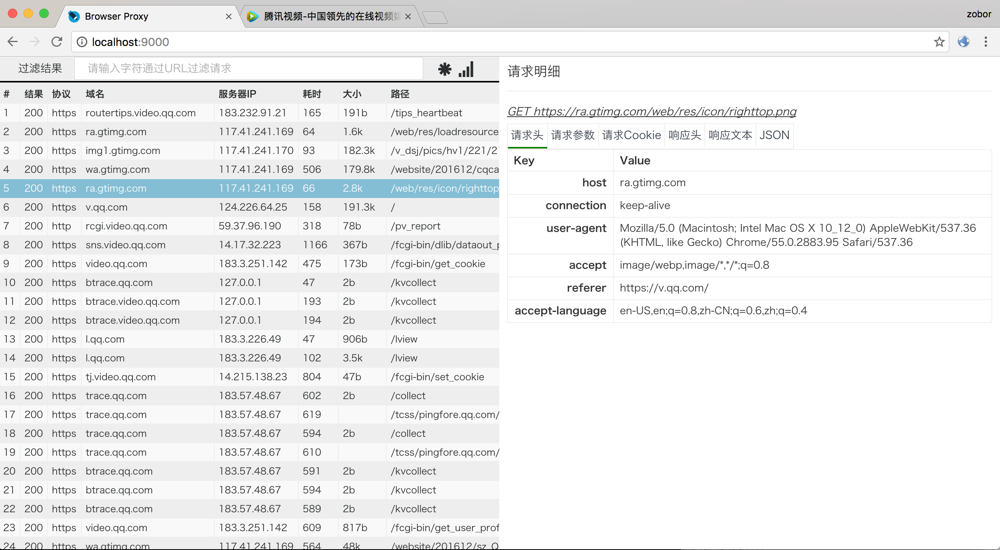
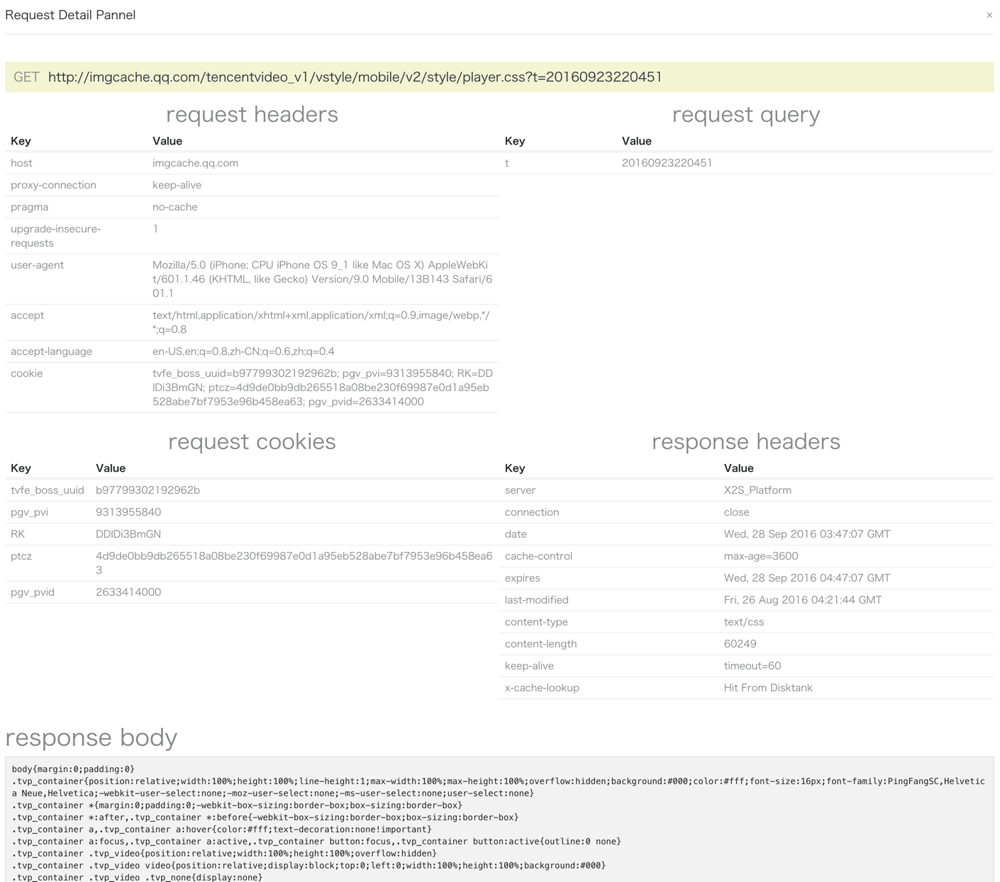

# browser-proxy

## UI界面



## 前端调试的代理调试工具
* 代理到本地文件
* 支持host设置（支持单个请求host）
* 代理到url
* 文件合并
* 修改配置立即生效
* 基于nodejs，支持windows, mac, linux
* 添加response headers


## 安装与启动
```
npm install browser-proxy -g

// start browser proxy with default
browser-proxy

// set port & start browser-proxy
browser-proxy -p 8888

// set a config file
browser-proxy -c /path/to/local/file/browser-proxy.config.js
```
## 启动UI界面，浏览器打开

[http://localhost:9000](http://localhost:9000)

## 代理规则

`代理规则参考config.example.js`

### >> 代理请求到本地文件
```
{
	"indexof": "http://m.v.qq.com/tvp/index.html",
	"localFile": "/path/to/local/file/index.html"
}
```
### >> 代理请求到本地目录
```
{
  "regxPath": "http://imgcache.qq.com/tencentvideo_v1/tvp/js/([^?]+)",
  "localPath": "/path/to/local/file/"
}
```
### >> 代理文请求添加responseHeaders
```
{
  "regxPath": "http://imgcache.qq.com/tencentvideo_v1/tvp/js/([^?]+)",
  "localPath": "/Users/zoborzhang/codes/tvp/",
	"responseHeaders": {
		"Access-Control-Allow-Origin":"http://v.qq.com",
		"Access-Control-Allow-Credentials": "true"
	}
}
```
### >> cdn合并请求代理
```
{
  "regxCombo": "http://vm.gtimg.cn/c/=/tencentvideo/txp/js/([^?]+)",
  "replacePath": "\/tencentvideo\/txp\/js\/",
  "localPath": "/path/to/local/file/",
  "responseHeaders": {
	"Access-Control-Allow-Origin":"http://v.qq.com",
	"Content-Type": "application/javascript",
    "Access-Control-Allow-Origin":"*"
  }
}
```
### >> 支持cgi jsonp
```
{
  "indexof": "http://m.v.qq.com/getinfo",
  "localFile": "/path/to/local/file/getinfo.json"
  "useJSONPCallback": true
}
```
### >> cgi指定返回http status code
```
{
  "indexof": "http://m.v.qq.com/getinfo",
  "httpResponseCode": "404"
}
```
### >> 单个请求指定hosts
```
{
  "indexof": "http://qzs.qq.com/tencentvideo_v1/tvp/js/tvp.player_v2_txv_vod.js",
  "host": "10.123.9.9"
}
```
### >> 修改host无需重启app
```
var hosts = function(){
/*

#127.0.0.1 vm.gtimg.cn
127.0.0.1 qzs.qq.com

*/
};
```